# ALEXA CHATBOT INTEGRATION

### TABLE OF CONTENTS
* [Introduction](#introduction)
* [Features](#features)
* [Building the Alexa Connector](#building-the-alexa-connector)
    * [Required Configuration](#required-configuration)
    * [Optional Configuration](#optional-configuration)
	* [ESCALATION (chat.php)](#escalation-chatphp)
	* [CONVERSATION (conversation.php)](#conversation-conversationphp)
	* [ENVIRONMENTS (environments.php)](#environments-environmentsphp)
	* [Deployment](#deployment)
* [Alexa Configuration](#alexa-configuration)
    * [Account](#account)
    * [Skill ID](#skill-id)
* [Alexa Requests](#alexa-requests)
* [Alexa Intents](#alexa-intents)
    * [Correct Use](#correct-use)
    * [Overwriting Built-in Intents](#overwriting-built-in-intents)
* [Prepare your Inbenta instances](#prepare-your-inbenta-instances)
    * [Text Content](#text-content)
    * [Built-in Intent response](#built-in-intent-response)


## **Introduction**
You can extend Inbenta’s chatbot capabilities to voice with this connector to integrate with [Alexa](https://alexa.amazon.com/spa/index.html#welcome).

## **Features**
The following features of Inbenta’s chatbot are supported in the Alexa integration:
* Answer Text.
* Sidebubble.
* Multiple options.
* Polar Questions.
* Dialogs.
* Forms, Actions & Variables (Keep in mind we are using voice as a channel. So, not all variable types work best with voice. Example: Email, Date).

## **Building the Alexa Connector**

### **Required Configuration**

In your UI directory, go to **conf**. Here, you have a readme file with some structure and usage explanations.

Fill the **key** and **secret** values inside the **conf/custom/api.php** file with your Inbenta Chatbot API credentials ([Here](https://help.inbenta.com/en/general/administration/managing-credentials-for-developers/finding-your-instance-s-api-credentials/) is the documentation on how to find the key and secret from Inbenta’s backstage. Use the same credentials as backstage to access the article).

### **Optional Configuration**

There are some optional features (see the list below) that can be enabled from the configuration files. Every optional configuration file should be copied from **/conf/default** and the custom version should be stored in **/conf/custom**. The bot will detect the customization and it will load the customized version. 


### **ESCALATION (chat.php)**

*   **chat** 
    *   **enabled**: Enable or disable HyperChat (“**true**” or “**false**”).
    *   **address**: Phone number that will be used to make the transfer (e.g. ```tel:+00000000```)
*   **triesBeforeEscalation**: Number of no-result answers in a row after the bot should escalate to an agent (if available). Numeric value, not a string. Zero means it’s disabled.
*   **negativeRatingsBeforeEscalation**: Number of negative content ratings in a row after the bot should escalate to an agent (if available). Numeric value, not a string. Zero means it’s disabled.

**Important note**: Escalation has not been implemented yet with this connector. Calls to an Escalation Form will be redirected to a regular text message notifying the user that it is not possible to do so.


### **CONVERSATION (conversation.php)**

*   **default:** Contains the API conversation configuration. The values are described below:
    *   **answers:**
        *   **sideBubbleAttributes:** Dynamic settings to show side-bubble content. Because there is no side-bubble in Alexa the content is shown after the main answer.
        *   **answerAttributes:** Dynamic settings to show as the bot answer. The default is [ "ANSWER_TEXT" ]. Setting multiple dynamic settings generates a bot answer with concatenated values with a newline character (\n).
        *   **maxOptions:** Maximum number of options returned in a multiple-choice answer.
    *   **forms**
        *   **allowUserToAbandonForm:** Whether or not a user is allowed to abandon the form after a number of consecutive failed answers. The default value is **true**.
        *   **errorRetries:** The number of times a user can fail a form field before being asked if he wants to leave the form. The default value is 3.
    *   **lang:** Language of the bot, represented by its ISO 639-1 code. Accepted values: ca, de, en, es, fr, it, ja, ko, nl, pt, zh, ru, ar, hu, eu, ro, gl, da, sv, no, tr, cs, fi, pl, el, th, id, uk
*   **user_type**: Profile identifier from the Backstage knowledge base. Minimum:0\. Default:0\. You can find your profile list in your Chatbot Instance → Settings → User Types.
*   **source**: Source identifier (default value **alexa**) used to filter the logs in the dashboards.


### **ENVIRONMENTS (environments.php)**

This file allows configuring a rule to detect the current environment for the connector, this process is made through the URL where the application is running. It can check the current **http_host** or the **script_name** in order to detect the environment.

*   **development:** 
    *   **type**: Detection type: check the **http_host** (e.g. [_www.example.com_](http://www.example.com/)) or the **script_name** (e.g. _/path/to/the/connector/server.php_).
    *   **regex**: Regex to match with the detection type (e.g. “_/^dev.mydomain.com$/m_“ will set the “development” environment when the detection type is [_dev.example.com_](http://dev.example.com/)).


### **Deployment**
The Alexa template must be served by a public web server in order to allow Alexa to send the events to it. The environment where the template has been developed and tested has the following specifications

*   Apache 2.4
*   PHP 7.3
*   PHP Curl extension
*   Non-CPU-bound
*   The latest version of [**Composer**](https://getcomposer.org/) (Dependency Manager for PHP) to install all dependencies that Inbenta requires for the integration.
*   If the client has a **distributed infrastructure**, this means that multiple servers can manage the user session, they must adapt their SessionHandler so that the entire session is shared among all its servers.


# **Alexa Configuration**

## **Account**

Log in to your Amazon account or create a new account(https://developer.amazon.com/alexa/console/ask):

Click on **Create New Skill**

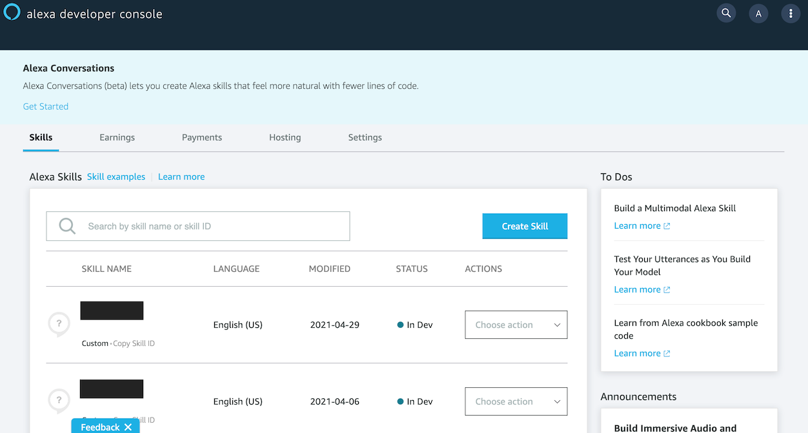

Choose a Skill name (the name will not be relevant to the user) and a default language of your choice (as long as it is supported by Inbenta):

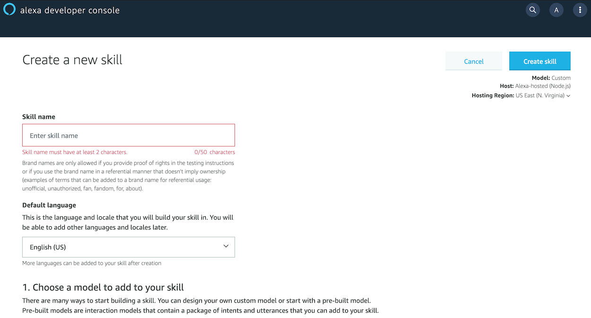


On the **Choose a model to add to your skill** section choose **Custom** (default selection)

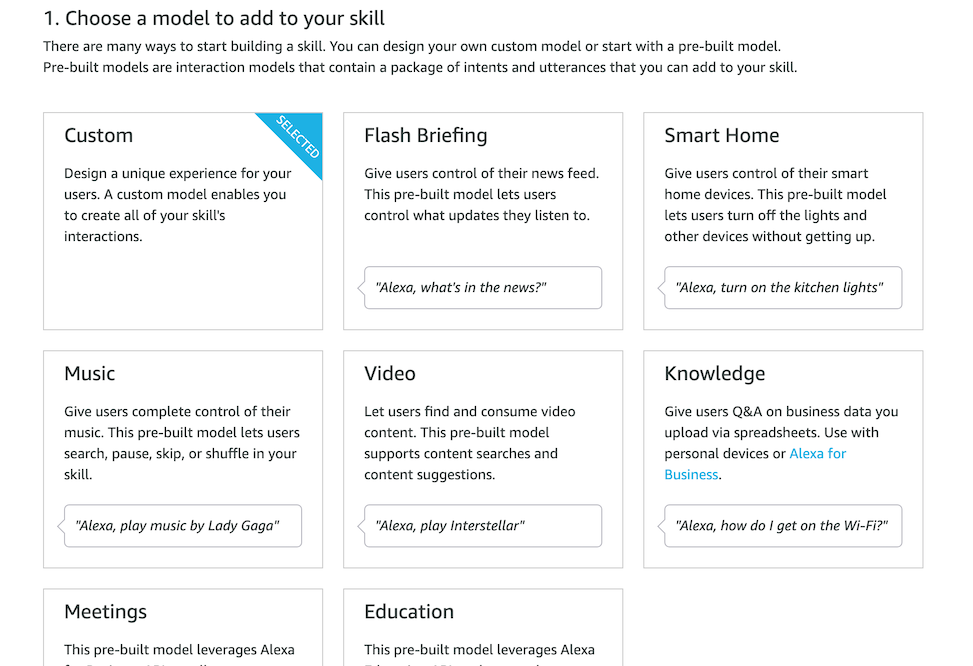


And on the **Choose a method to host your skill's backend resources** section select **Provision your own**

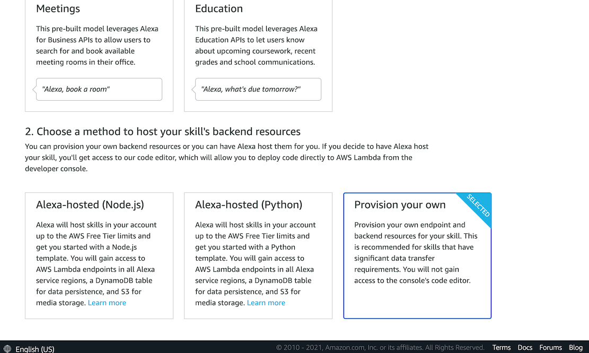


After creating the skill, on the **Choose a template to add to your skill** select **Start from Scratch**

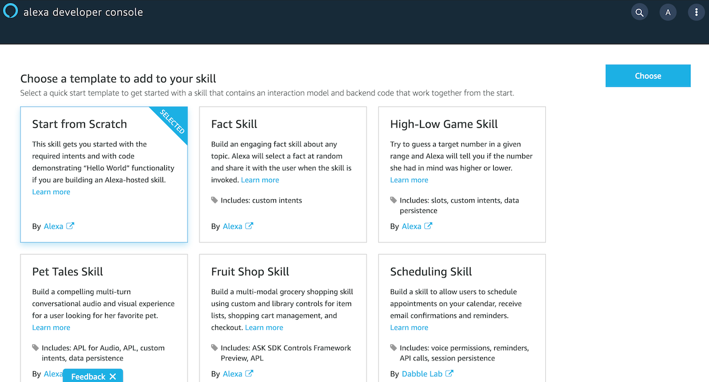


This should take you to your skill's configuration page. Now the first thing you can do is set your skill's **Invocation**. Keep in mind that this is what the user will say before using your skill, so it should be relevant to its content without being too wordy or complicated.

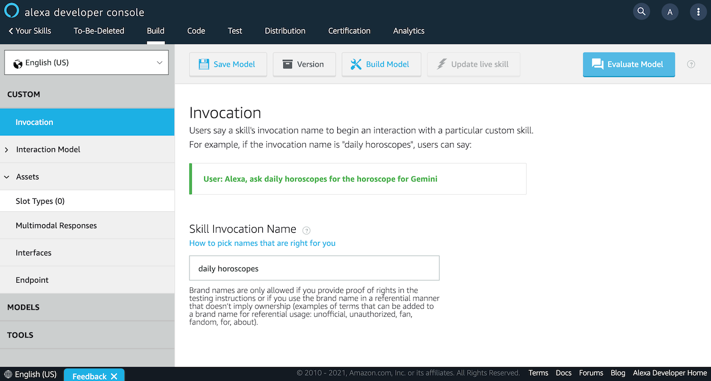

The next step is to add a **Slot Type**. You can find more information on Slot Types [here](https://developer.amazon.com/en-US/docs/alexa/custom-skills/create-and-edit-custom-slot-types.html).

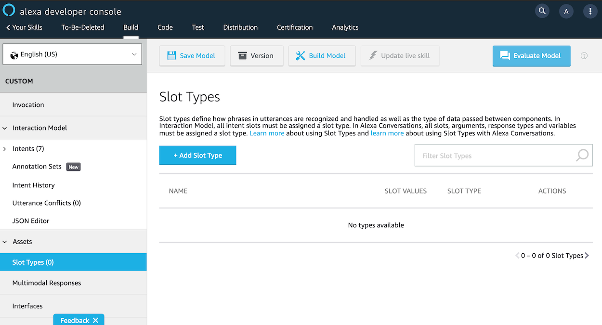

Create a new **Slot type** called "Inbenta_Catchall" and add "anything can be matched to this" as a **Slot Value** (the name "Inbenta_Catchall" is not necessary for the Connector to work, and the Slot Value can be any multiple-word sentence). Make sure the value is entered (pressing enter).

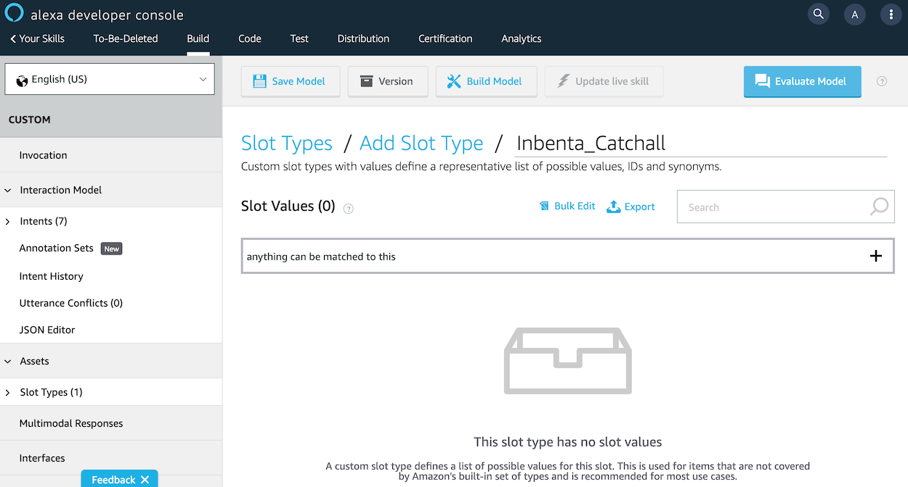

Navigate to the **Intents** section of your skill. Before adding a new intent, delete the example "HelloWorldIntent". Now, click on "+Add Intent":
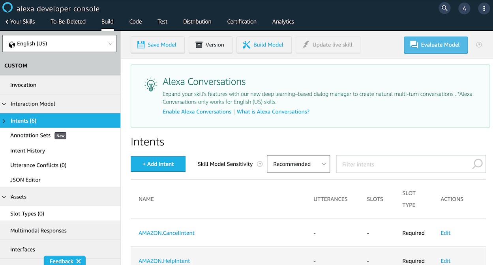

Name the new intent and name it" CatchallIntent" (**Important**: the name of this intent is case-sensitive. It is used by the Connector. It will not be able to process it if is called anything else).

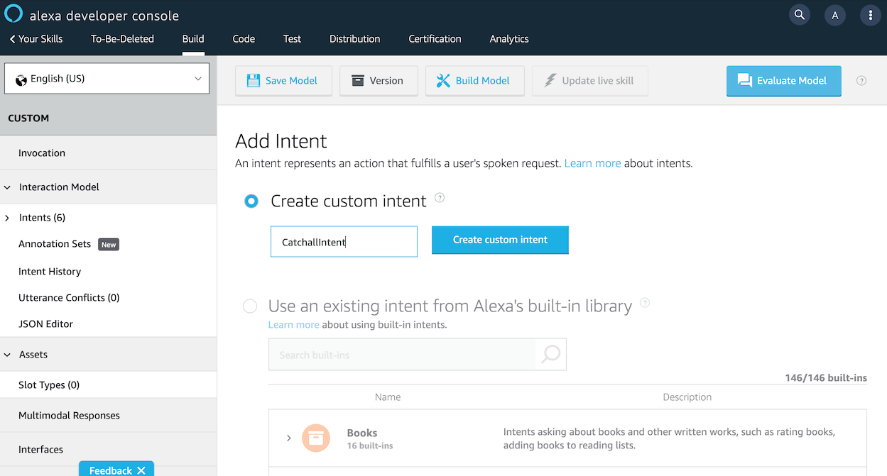


Scroll down to the **Intent Slots** section and add a new one called "{catchall}" (**Important**: the name of this intent slot is case-sensitive. It is used by the Connector. It will not be able to process the intent if is called anything else). Then, choose the **Slot Type** to be "Inbenta_Catchall".

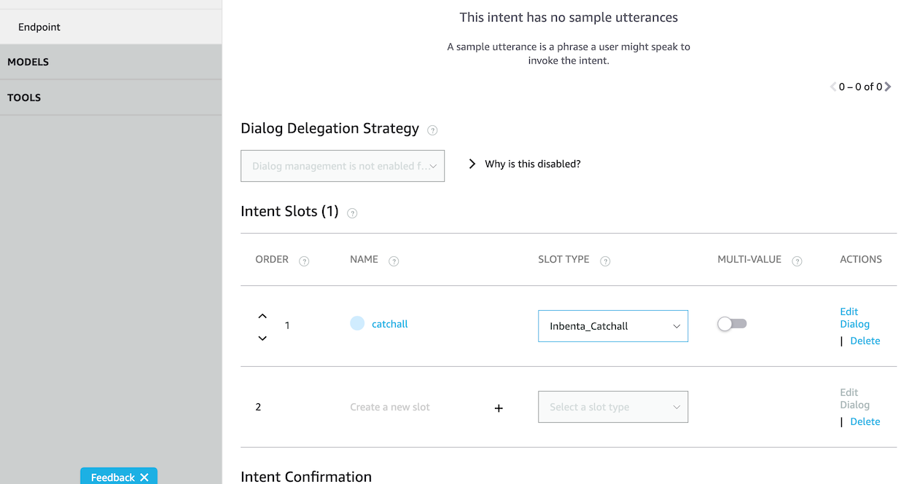

Insert a new **Sample Utterance** as "{catchall}". The console should match the color of the slot inserted in the Sample Utterance section to the one in Intent Slots.

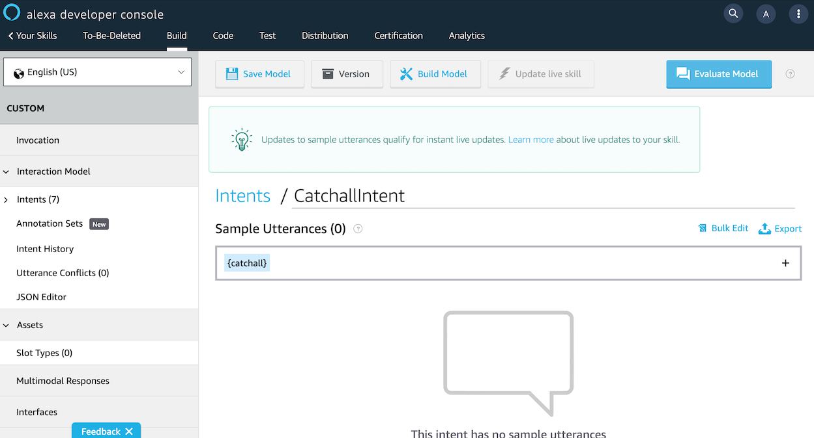

Now, nagicate to the **Endpoint** section of your skill and select "HTTPS". Enter URL of the server where this connector is hosted and from the dropdown selector, choose the option that best fits the URL (if the URL is a subdomain such as: https://example.server.com you will need to select the second option). Note that the Endpoint must use a secure transfer protocol.

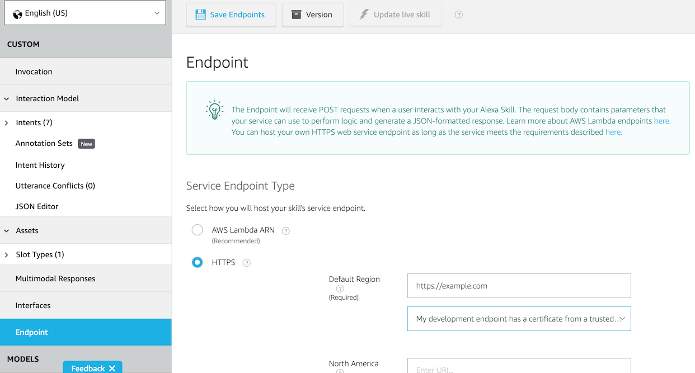

Save and build your skill.


## **Skill ID**

The **Skill ID** is a password-like value, which can be used to ensure that the incoming calls from Alexa are coming from the skill you created and not some other one. In order to access your key, you will need to navigate to the menu of your Alexa Developer Console and click on **Copy Skill ID**:

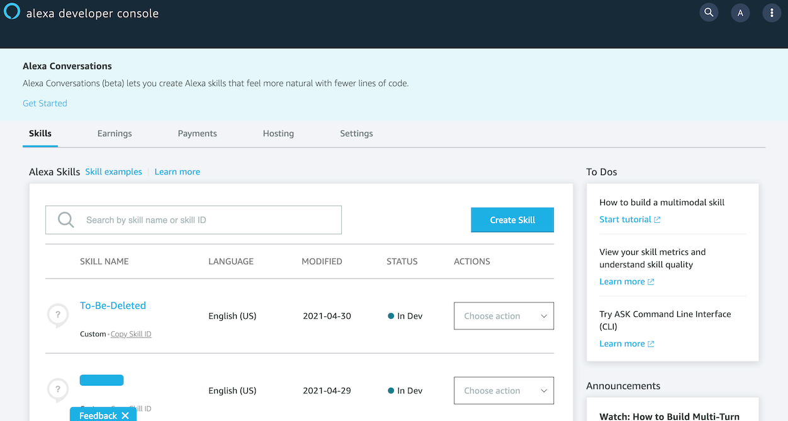

Once you have it on your clipboard, paste it into the **conf/custom/alexa.php** file:

```php
return [
    'id' => 'amzn1.ask.skill.0000x000-xx00-0000-00x0-000x00000x00'
];
```
# **Alexa Requests**

* **LaunchRequest**: This will always be the first request sent to your chatbot instance. This connector requires your instance to have an intent with its **Direct Call** set to *"sys-welcome"*.
* **IntentRequest**: This can contain a number of different *Intents*. What they are and how they are treated is convered in the **Alexa Intents** section below.
* **SessionEndedRequest**: This request does not allow for any more output from your skill. It is simply used to end the session. This connector calls:
```php
 session_destroy()
 ```

# **Alexa Intents**

*   **Built-in intents:** The built-in (standard) intents are used for common, general actions such as stopping, canceling, and asking for help. These are present in all Alexa Skills and cannot be removed.
    * **AMAZON.CancelIntent**: This Intent is called when the user says *"cancel"*, *"nevermind"*, *"forget it"*, or something else along those lines. This Intent has the purpose of cancelling a transactions. However, Inbenta does not offer a direct call to cancel transactions, so this connector treats all **CancelIntent**'s as "cancel" and sends that to the Chatbot.
    * **AMAZON.HelpIntent**: This Intent is called when the user says *"help"*, *"help me"*, *"can you help me"*, etc. In this case, the Connector currently sends the message *"help"* to the Chatbot, however it is recommended that you include a Custom "Help" Intent in your Chatbot instance and include a **Direct Call** such as *"sys-help"*. Then, you'll be able to map all **HelpIntent**'s to that content directly.
    * **AMAZON.StopIntent**: This Intent is called when the user says *"stop"*, *"off"*,*"shut up"*, etc. The connector expects your Chatbot instance to have an **Inbenta Intent** with the **Direct Call** field set to *"sys-goodbye"*. This allows the chatbot to send a goodbye message to the user before Alexa stops the Skill. Not including a *"sys-goodbye"* intent in your Chatbot instance will cause an error.
    * **AMAZON.FallbackIntent**: Because of the custom intent we created (**CatchallIntent**), this intent can be ignored. It will never be called.
    * **AMAZON.NavigateHomeIntent**: As stated in the [documentation](https://developer.amazon.com/en-US/docs/alexa/custom-skills/standard-built-in-intents.html): *"This intent is automatically added to your interaction model after you save your model. The intent is handled by Alexa so you do not need to create an intent handler for it as long as your skill properly handles "exit" requests as required."*

    


## **Correct Use**
In order for Alexa to always be able to match the user input to the **CatchallIntent** do not include any other **Custom Intents** in your skill.


## **Overwriting Built-in Intents**

If you want to catch a specific user input that would otherwise be matched to a **Built-in Intent**, you need to include that value in your **Slot Type** (Inbenta_Catchall) in addition to the value that has already been included (*"anything can be matched to this"*). For example, if for some reason you needed to collect the user input for *"nevermind"*, which would otherwise be mapped to **AMAZON.CancelIntent**, you can include *"nevermind"* in **Inbenta_Catchall**.
**Note** that his will cause a **warning** to appear when you build your project.


# **Prepare your Inbenta instances**

## **Text Content**

We should always keep in mind that user interaction is going to be through voice. 

Hence, content should be simple text: **avoid the use of HTML tags, multimedia and URLs**. This is especially important if you are using Voice template, most of the HTML tags are not recognized by the TTS (Text-To-Speech) services.

It is also important to think about how certain phrases will be sound when spoken outloud by Alexa. A question that asks the user "Do you want A or B?" can either be prompting the user to choose between the two options, or asking the user whether they want either of the options (a yes or no question). Although written both questions are identical, when spoken they mean very different things. Rephrasing questions and adding commas where there should be pauses can help make question clearer when spoken.

Note: “**Natural Language Search**” is the best **Transition type** for dialogs. With this type of transition, the options are not attached to Alexa's response at the end; instead, the options should be clearly presented in a natural manner in the text of the content.

## **Built-in Intent response**

Refer to the **Alexa Intents** section to make sure that you have all of the **Direct Call**'s that this connector requires of your instance.
